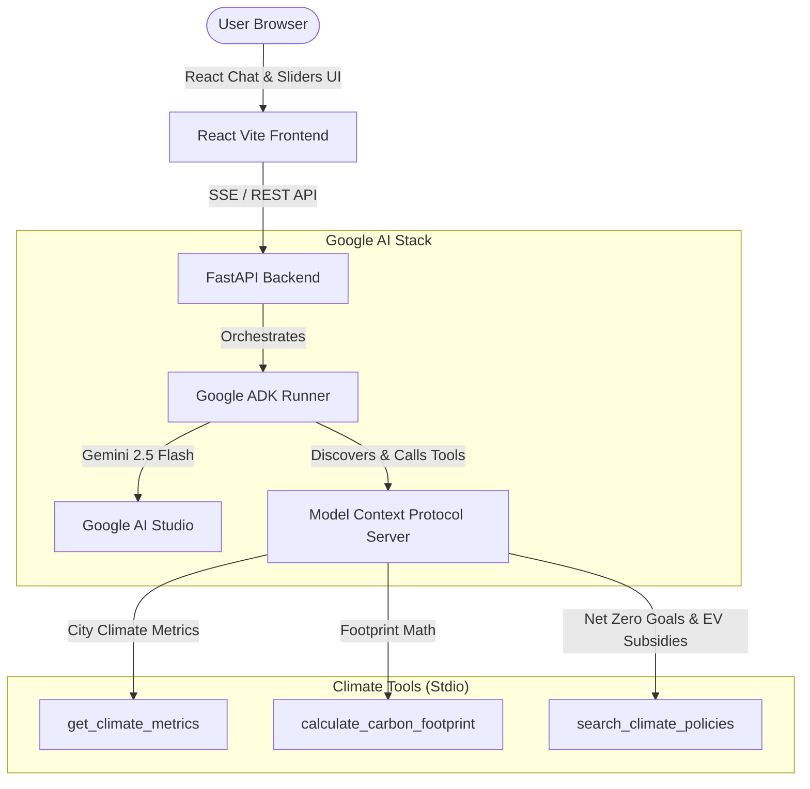

# EcoPulse: AI Climate Action Agent

🌐 **Live Demo**: https://ai-agent-series-builder-2026-nac4-f5jmwu0b9.vercel.app
🔗 **Backend API**: https://ai-agent-series-builder-2026-1.onrender.com
🎬 **Video Demo**: *(add your Loom/YouTube link here)*

EcoPulse is an agentic Climate Intelligence and Action platform built as a submission for the **AI Agent Builder Series 2026** hosted by AI House & Google for Developers. 

It leverages the **Google AI Stack**, featuring the **Google Agent Development Kit (ADK 2.0)** for multi-turn agent orchestration and the **Model Context Protocol (MCP)** for clean, decoupled tool integration.

---

## 🚀 Key Features

* **Aura AI Agent Chat**: Converse with a Gemini 2.5 Flash agent equipped with environmental science logic. It executes real-time calculations and live policies lookups via standard MCP tools.
* **Carbon Tracker Dashboard**: Input transport, utility, and dietary metrics using interactive sliders to compute your metric tons of CO2 footprint and see tree-planting offset recommendations.
* **Climate Pulse Geographical Profiler**: Look up localized environmental metrics (Decadal warming indices, Air Quality Indexes, renewable energy grid mixes) and country-specific Net-Zero policy targets.
* **Streaming Tool Feedback**: The UI renders status chips dynamically to show when the ADK Agent is invoking MCP tools (e.g. `[Running tool: calculate_carbon_footprint]`).

---

## 🛠 Architecture Overview

The application utilizes a clean separation of concerns: a React/Vite client dashboard, a FastAPI backend running the Google ADK runner, and a custom Stdio-based Model Context Protocol (MCP) tool server.



---

## 📦 Tech Stack

* **Frontend**: React 18, TypeScript, Vite, Framer Motion (for premium micro-animations), Lucide Icons, and Vanilla CSS tokens.
* **Backend**: FastAPI (Python), Uvicorn, Python-dotenv.
* **Agentic Orchestration**: Google Agent Development Kit (ADK) 2.0 (running on the main loop via `run_async`).
* **Tool Standards**: Model Context Protocol (MCP) implemented using `FastMCP` (communicates over stdio).
* **LLM Foundation**: Gemini 2.5 Flash via Google AI Studio.

---

## 💻 Installation & Local Run

### Prerequisites
* Python 3.10+
* Node.js 18+
* A Gemini API key from [Google AI Studio](https://aistudio.google.com/)

### 1. Backend Setup
Navigate to the backend directory and configure the environment:
```bash
cd backend
python3 -m venv venv
source venv/bin/activate
pip install -r requirements.txt
```

Create a `.env` file in the `backend` directory and add your API key:
```env
GEMINI_API_KEY=AIzaSy...
```

Start the FastAPI server:
```bash
python main.py
```
*The API will start running at `http://127.0.0.1:8000`.*

### 2. Frontend Setup
Open a new terminal window, navigate to the frontend directory, and run the developer server:
```bash
cd frontend
npm install
npm run dev
```
*The UI dashboard will start serving at `http://localhost:5173`.*

---

## 📄 File Directory Structure
```text
AI-Agent-Series-Builder-2026/
├── backend/
│   ├── .env                  # Environment keys
│   ├── requirements.txt      # Python packages (google-adk, fastmcp)
│   ├── mcp_server.py         # MCP Climate tools definition
│   ├── agent.py              # ADK Agent and Runner configuration
│   └── main.py               # FastAPI endpoints & async generators
├── frontend/
│   ├── src/
│   │   ├── components/
│   │   │   ├── Sidebar.tsx   # Glassmorphic side navigation
│   │   │   ├── Chat.tsx      # Agentic chat panel with streaming SSE
│   │   │   ├── Dashboard.tsx # Carbon calculator graph panel
│   │   │   └── Pulse.tsx     # Climate profiling search
│   │   ├── App.tsx           # Layout coordinating tabs
│   │   ├── index.css         # Curated HSL dark/emerald design system
│   │   └── main.tsx          # Bootstrapper
│   ├── index.html            # Entry HTML loading google fonts
│   ├── package.json          # Node settings
│   └── tsconfig.json         # TS settings
└── README.md                 # Project Documentation
```
