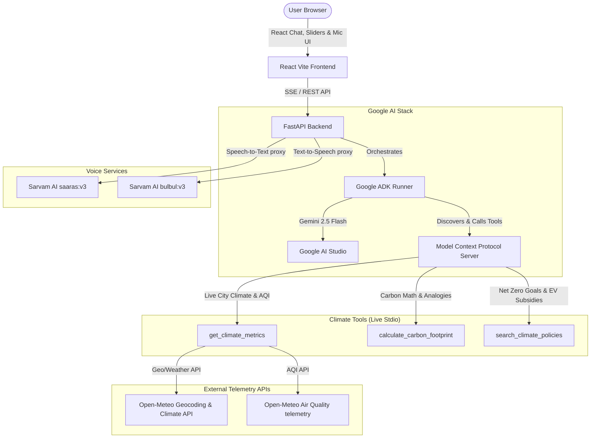

# EcoPulse: AI Climate Action Agent

🌐 **Live Demo**: https://ai-agent-series-builder-2026-nac4.vercel.app
🔗 **Backend API**: https://ecopulse-backend-805096709254.us-central1.run.app
🎬 **Video Demo**: https://www.loom.com/share/662d8c6e7a6d48e2b2e49974005afd10

EcoPulse is an agentic Climate Intelligence and Action platform built as a submission for the **AI Agent Builder Series 2026** hosted by AI House & Google for Developers. 

It leverages the **Google AI Stack**, featuring the **Google Agent Development Kit (ADK 2.0)** for multi-turn agent orchestration and the **Model Context Protocol (MCP)** for clean, decoupled tool integration.

---

## 💡 Problem Statement

Climate change is the defining challenge of our generation — yet most people have no idea what their individual impact is or what they can actually do about it. 

**EcoPulse** is an advanced, enterprise-grade AI Agent system designed to democratize climate action. Powered by the **Google AI Stack** (Gemini 2.5 Flash, Google ADK, and Model Context Protocol) and integrated with **Sarvam AI**, EcoPulse translates global environmental intelligence, real-time telemetry, and localized policy frameworks into native speech across 11 major Indian languages. 

By unifying multi-persona agent coordination, live environmental tools, and native voice interfaces, EcoPulse bridges the gap between complex climate data and daily personal action—bringing tailored sustainability guidance directly to regional communities.

---

## 🚀 Key Features

* **Aura AI Agent Chat (Multi-Persona)**: Converse with a Gemini 2.5 Flash agent that dynamically coordinate between three specialized personas:
  1. **Carbon Auditor**: Analyzes emissions datasets and offset metrics.
  2. **Policy Advisor**: Tracks net-zero targets and national solar/EV incentives.
  3. **Urban Ecologist**: Evaluates local heat risk indices and air pollution profiles.
* **Autonomous Utility Bill Auditor**: Upload a utility bill document (e.g. `.txt`) directly in the chat interface. The Gemini Carbon Auditor agent autonomously parses the text, extracts energy consumption (kWh), executes carbon offset calculations using MCP tools, and updates the database on-the-fly.
* **Multilingual Eco-Voice Hub**: Speak to the Aura agent in any of the 11 major Indian languages (Hindi, Tamil, Telugu, Marathi, Kannada, etc.) using Sarvam AI's STT (`saaras:v3`) and receive vocalized responses translated via TTS (`bulbul:v3`).
* **Live Environmental Telemetry**: Queries live APIs on-the-fly to pull real weather, climate risk anomalies, and air quality indices (US AQI, PM2.5, PM10) for any city globally via Open-Meteo geocoding.
* **Carbon Tracker Dashboard**: Input transport, utility, and dietary metrics using interactive sliders to compute your metric tons of CO2 footprint and see tree-planting offset recommendations alongside real-world equivalents (smartphone charges, economy flights).
* **Integrated Green Marketplace Broker**: Turn conversational recommendations into direct commercial action. If a user's electricity footprint is high, the agent queries local solar vendors via MCP, provides an exact installation sizing and quote (accounting for PM Surya Ghar state subsidies in India or ITC credits in the US), and delivers a direct affiliate referral checkout link.
* **Smart Home & IoT Telemetry**: Connects directly to smart devices (e.g., Google Nest thermostats). Users can check current temperatures and real-time power draw (kW) or adjust cooling targets directly. The ADK Agent can query status via `get_smart_device_status` and autonomously transition devices into energy-saving `ECO` modes via `adjust_smart_thermostat` during high-grid-intensity carbon cycles.
* **Climate Pulse Geographical Profiler**: Look up localized environmental metrics (Decadal warming indices, Air Quality Indexes, renewable energy grid mixes) and country-specific Net-Zero policy targets.
* **Interactive Climate Risk Geospatial Map**: Renders an interactive Leaflet-powered dark map layer dynamically. Overlays concentric heat buffers and AQI boundaries to visualize air pollution contours and decadal warming anomalies directly over the searched city.
* **Agent-to-Agent Carbon Offset Bidding**: Features a simulated multi-agent Bidding Room. Your personal EcoPulse Buyer Agent autonomously requests proposals, reviews certification verification grades, and negotiates bulk pricing against Pachama (Reforestation), Gold Standard (Methane Capture), and CleanAir (Solar grid offsets) registries in real-time.
* **Social Engagement**: Single-click copy badge to share Eco-Scores (A+ through F) directly to LinkedIn.
* **Streaming Tool Feedback**: The UI renders status chips dynamically to show when the ADK Agent is invoking MCP tools (e.g. `[Running tool: calculate_carbon_footprint]`).

---

## 🛠 Architecture Overview

The application utilizes a clean separation of concerns: a React/Vite client dashboard, a FastAPI backend running the Google ADK runner, and a custom Stdio-based Model Context Protocol (MCP) tool server.



---
## 📦 Tech Stack

* **Frontend**: React 18, TypeScript, Vite, Framer Motion (for premium micro-animations), Lucide Icons, and Firebase Client SDK.
* **Backend**: FastAPI (Python), Uvicorn, Python-dotenv, Firebase Admin SDK, and `aiokafka`.
* **Voice Engine**: Sarvam AI `saaras:v3` (STT) & `bulbul:v3` (TTS).
* **Agentic Orchestration**: Google Agent Development Kit (ADK) 2.0 (running on the main loop via `run_async`).
* **Tool Standards**: Model Context Protocol (MCP) implemented using `FastMCP` (communicates over stdio).
* **LLM Foundation**: Gemini 2.5 Flash via Google AI Studio.
* **Telemetry Data & Streams**: Open-Meteo Weather & Air Quality API, Dockerized Apache Kafka.

---

## 💻 Installation & Local Run

### Prerequisites
* Python 3.10+
* Node.js 18+
* Docker & Docker Compose (optional for real-time Kafka message streaming)
* A Gemini API key from [Google AI Studio](https://aistudio.google.com/)
* A Sarvam AI Subscription key from [Sarvam AI Dashboard](https://dashboard.sarvam.ai/)

### 1. (Optional) Run Kafka Event Broker
Spin up the Kafka instance in KRaft mode:
```bash
docker compose up -d
```
*Note: If Docker is not available, the backend server will run in standalone mock mode.*

### 2. Backend Setup
Navigate to the backend directory and configure the environment:
```bash
cd backend
python3 -m venv venv
source venv/bin/activate
pip install -r requirements.txt
```

Create a `.env` file in the `backend` directory and add your API key and configurations:
```env
GEMINI_API_KEY=AIzaSy...
KAFKA_BOOTSTRAP_SERVERS=localhost:9092
SARVAM_API_KEY=your_sarvam_api_key_here

# Optional Firebase Service account configuration
FIREBASE_SERVICE_ACCOUNT_PATH=/path/to/your-credentials.json
```

Start the FastAPI server:
```bash
python main.py
```
*The API will start running at `http://127.0.0.1:8000`.*

### 3. Frontend Setup
Open a new terminal window, navigate to the frontend directory, and run the developer server:
```bash
cd frontend
npm install
npm run dev
```
*The UI dashboard will start serving at `http://localhost:5173`.*

---

## ☁️ Deploying Backend to Google Cloud Run

Instead of Render, you can deploy the EcoPulse backend to **Google Cloud Run** — Google's fully managed serverless container platform.

### Step 1: Create a `Dockerfile` in `backend/`
```dockerfile
FROM python:3.10-slim

WORKDIR /app
COPY requirements.txt .
RUN pip install --no-cache-dir -r requirements.txt

COPY . .

EXPOSE 8080
CMD ["uvicorn", "main:app", "--host", "0.0.0.0", "--port", "8080"]
```

### Step 2: Deploy using Google Cloud SDK
1. Authenticate with Google Cloud:
   ```bash
   gcloud auth login
   gcloud config set project vemarai
   ```
2. Build and Deploy to Cloud Run:
   ```bash
   gcloud run deploy ecopulse-backend \
     --source . \
     --region us-central1 \
     --allow-unauthenticated \
     --set-env-vars="GEMINI_API_KEY=your_key,SARVAM_API_KEY=your_key"
   ```
Once completed, Google Cloud Run will provide a secure HTTPS endpoint (e.g. `https://ecopulse-backend-xxxxx.run.app`) to replace the Render link!

---

## 📄 File Directory Structure
```text
AI-Agent-Series-Builder-2026/
├── backend/
│   ├── .env                  # Environment keys
│   ├── requirements.txt      # Python packages (google-adk, fastmcp)
│   ├── Dockerfile            # Container definition for Cloud Run
│   ├── mcp_server.py         # MCP Climate tools definition
│   ├── agent.py              # ADK Agent and Runner configuration
│   └── main.py               # FastAPI endpoints & async generators
├── frontend/
│   ├── public/
│   │   └── logo.png          # Pulsating brand logo asset
│   ├── src/
│   │   ├── components/
│   │   │   ├── Sidebar.tsx   # Glassmorphic side navigation
│   │   │   ├── Chat.tsx      # Agentic chat panel with streaming SSE
│   │   │   ├── Dashboard.tsx # Carbon calculator graph panel
│   │   │   ├── Pulse.tsx     # Climate profiling search
│   │   │   ├── Voice.tsx     # Multilingual voice mode component
│   │   │   └── Negotiations.tsx # Agent-to-Agent offset bidding room
│   │   ├── App.tsx           # Layout coordinating tabs
│   │   ├── index.css         # Curated HSL dark/emerald design system
│   │   └── main.tsx          # Bootstrapper
│   ├── index.html            # Entry HTML loading google fonts
│   ├── package.json          # Node settings
│   └── tsconfig.json         # TS settings
└── README.md                 # Project Documentation
```
