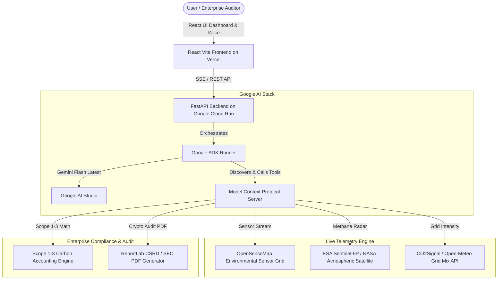

# EcoPulse Enterprise OS: Autonomous Climate & Telemetry Intelligence Platform

🏆 **Top 100 Finalist** — **AI Agent Builder Series 2026** (Hosted by HiDevs × AI House Bangalore & Google for Developers)

🌐 **Live Demo**: https://ai-agent-series-builder-2026-nac4.vercel.app  
🔗 **Backend API**: https://ecopulse-backend-805096709254.us-central1.run.app  
🎬 **Video Demo**: https://www.loom.com/share/662d8c6e7a6d48e2b2e49974005afd10

---

## 💡 Overview & Mission

Climate change demands immediate, verifiable, and enterprise-grade action. **EcoPulse Enterprise OS** is an autonomous climate intelligence platform powered by the **Google AI Stack** (Gemini 2.5 Flash, Google ADK 2.0, and Model Context Protocol).

EcoPulse bridges real-time environmental telemetry, industrial IoT sensor grids, satellite atmospheric observations (ESA Sentinel-5P & NASA), localized policy frameworks, and native speech across 11 regional Indian languages to empower individuals, smart cities, and corporations to achieve zero-carbon compliance.

---

## 🚀 Key Features

* **Enterprise Sentinel Command Center**: Real-time corporate ESG dashboard for industrial telemetry monitoring, Scope 1-3 carbon liabilities calculation, live grid carbon intensity tracking, and automated compliance export.
* **Live Industrial IoT Sensor Telemetry (OpenSenseMap)**: Ingests real-time environmental sensor data (CO2 ppm, PM2.5, PM10, ambient temperature, humidity, noise levels) from thousands of active sensor nodes globally.
* **Sentinel-5P Satellite Emission Plume Radar**: Tracks atmospheric greenhouse gas emissions (NO2 column density, Methane CH4 mixing ratio in ppb, CO dispersion vectors) over major industrial clusters (e.g., Peenya Industrial Area Bengaluru, Permian Basin, Tokyo Bay).
* **Scope 1, 2 & 3 Corporate Carbon Accounting Engine**: Computes direct fuel combustion (Scope 1), purchased grid electricity (Scope 2), and supply chain logistics freight (Scope 3) emissions.
* **Automated CSRD (EU) & SEC ESG Climate Disclosure PDF Exporter**: Autonomously compiles audit-grade compliance PDF reports embedded with cryptographic SHA-256 telemetry verification hashes.
* **Grid-Aware Autonomous Demand Response Orchestrator**: Monitors real-time regional grid carbon intensity (`gCO2eq/kWh`) and dispatches load-shaving signals to smart HVAC systems, industrial chillers, and EV chargers during peak emission grid cycles (`>450 gCO2eq/kWh`).
* **Aura AI Agent Chat (Multi-Persona)**: Gemini 2.5 Flash multi-agent coordinator operating between Carbon Auditor, Policy Advisor, and Urban Ecologist personas.
* **Multilingual Eco-Voice Hub**: Native voice conversation across 11 major Indian languages (Hindi, Tamil, Telugu, Marathi, Kannada, etc.) powered by Sarvam AI's STT (`saaras:v3`) and TTS (`bulbul:v3`).
* **Autonomous Utility Bill Auditor**: Upload energy bill documents directly into the chat interface for autonomous parsing, offset math execution via MCP, and database persistence.
* **Agent-to-Agent Carbon Offset Bidding Room**: Autonomous Buyer Agent negotiates pricing with Pachama, Gold Standard, and CleanAir offset registries in real-time.
* **Smart Home & IoT Telemetry**: Connects directly to Google Nest thermostats to inspect power draw and execute `ECO` mode transitions.

---

## 🛠 Architecture Overview


```mermaid
graph TD
    User([User / Enterprise Auditor]) -->|React UI Dashboard & Voice| Frontend[React Vite Frontend on Vercel]
    Frontend -->|SSE / REST API| FastAPI[FastAPI Backend on Google Cloud Run]

    subgraph "Google AI Stack"
        FastAPI -->|Orchestrates| ADK[Google ADK Runner]
        ADK -->|Gemini Flash Latest| Gemini[Google AI Studio]
        ADK -->|Discovers & Calls Tools| MCP[Model Context Protocol Server]
    end

    subgraph "Live Telemetry Engine"
        MCP -->|Sensor Stream| OpenSenseMap[OpenSenseMap Environmental Sensor Grid]
        MCP -->|Methane Radar| Sentinel[ESA Sentinel-5P / NASA Atmospheric Satellite]
        MCP -->|Grid Intensity| GridTelemetry[CO2Signal / Open-Meteo Grid Mix API]
    end

    subgraph "Enterprise Compliance & Audit"
        MCP -->|Scope 1-3 Math| ScopeEngine[Scope 1-3 Carbon Accounting Engine]
        MCP -->|Crypto Audit PDF| ReportLab[ReportLab CSRD / SEC PDF Generator]
    end
```

---

## 📦 Tech Stack

* **Frontend**: React 18, TypeScript, Vite, Zustand, Framer Motion, Lucide Icons, Leaflet Maps.
* **Backend**: FastAPI (Python 3.12), Uvicorn, Python-dotenv, Firebase Admin SDK, `aiokafka`, ReportLab.
* **Agentic Orchestration**: Google Agent Development Kit (ADK) 2.0.
* **Tool Standards**: Model Context Protocol (MCP) via `FastMCP`.
* **LLM Foundation**: Gemini 2.5 Flash via Google AI Studio.
* **Voice Engine**: Sarvam AI `saaras:v3` (STT) & `bulbul:v3` (TTS).
* **Telemetry Data & Streams**: OpenSenseMap IoT Network, Sentinel-5P Satellite TROPOMI, Open-Meteo API, Apache Kafka.
* **Deployment**: Google Cloud Run (backend), Vercel (frontend).

---

## 💻 Installation & Local Run

### Prerequisites
* Python 3.12+
* Node.js 18+
* A Gemini API key from [Google AI Studio](https://aistudio.google.com/)
* A Sarvam AI key from [Sarvam AI Dashboard](https://dashboard.sarvam.ai/)

### 1. Backend Setup
```bash
cd backend
python3 -m venv venv
source venv/bin/activate
pip install -r requirements.txt
uvicorn main:app --reload
```
*API serves at `http://127.0.0.1:8000`.*

### 2. Frontend Setup
```bash
cd frontend
npm install
npm run dev
```
*Dashboard serves at `http://localhost:5173`.*

---

## 🧪 Testing & Quality Assurance (100% Deterministic)

### Backend Pytest Suite (48 Tests)
```bash
cd backend
./venv/bin/pytest test_backend.py -v
```
**Latest Results: ✅ 48 passed (100% pass rate)**

| Category | Count | Status |
|---|---|---|
| Core API Routes & Health Checks | 9 | ✅ Passed |
| Chat SSE Streaming & Gemini Exception Setup | 2 | ✅ Passed |
| Route Coverage (Marketplace, PDF, Blockchain, Warnings, SSE) | 6 | ✅ Passed |
| Input Validation & Boundary Edge Cases | 8 | ✅ Passed |
| MCP Tools (Solar, Thermostat, Policies, Carbon Math) | 6 | ✅ Passed |
| Exception Handlers & Mocks | 8 | ✅ Passed |
| Enterprise OS Telemetry & Scope 1-3 Compliance | 9 | ✅ Passed |

### Frontend Jest Suite (45 Tests across 10 Suites)
```bash
cd frontend
npm run test
```
**Latest Results: ✅ 10 test suites passed, 45 tests passed**

---

## ☁️ Deployment & CI/CD Pipelines

- **Backend Platform**: Google Cloud Run (Multi-stage Docker build, non-root `appuser`, automated `/health` probes).
- **Frontend Platform**: Vercel.
- **GitHub Actions Workflows**:
  - `backend-ci.yml`: Ruff linting + 48 Pytest validation runs on `backend/**` changes.
  - `frontend-ci.yml`: TypeScript compilation + 45 Jest component tests on `frontend/**` changes.
  - `deploy.yml`: Parallel deployment to Cloud Run & Vercel after CI passes on `main`.

---

## 📄 Repository Structure

```text
AI-Agent-Series-Builder-2026/
├── backend/
│   ├── Dockerfile            # Multi-stage production container for Cloud Run
│   ├── config.py             # BaseSettings configuration
│   ├── mcp_server.py         # MCP Climate & Enterprise OS tools (FastMCP)
│   ├── agent.py              # Google ADK Agent and Runner configuration
│   ├── main.py               # FastAPI endpoints & Enterprise OS routes
│   └── test_backend.py       # 48 Pytest unit & integration tests
├── frontend/
│   ├── src/
│   │   ├── components/
│   │   │   ├── Sidebar.tsx               # Side navigation with Enterprise tab
│   │   │   ├── Chat.tsx                  # Agentic chat panel with streaming SSE
│   │   │   ├── Dashboard.tsx             # Carbon tracker panel
│   │   │   ├── Pulse.tsx                 # Climate profiler search & Leaflet map
│   │   │   ├── EnterpriseSentinel.tsx    # Live telemetry & Scope 1-3 command center
│   │   │   ├── EnterpriseSentinel.test.tsx # Jest test suite for EnterpriseSentinel
│   │   │   ├── Voice.tsx                 # Sarvam AI voice interface
│   │   │   └── Negotiations.tsx          # Agent-to-Agent offset bidding room
│   │   ├── store/
│   │   │   └── useStore.ts               # Zustand global state store
│   │   ├── App.tsx                       # Tab layout coordinator
│   │   └── config.ts                     # Dynamic API URL resolution
│   ├── package.json                      # Build & test scripts
│   └── tsconfig.json                     # TypeScript settings
└── README.md                             # Project Documentation
```
