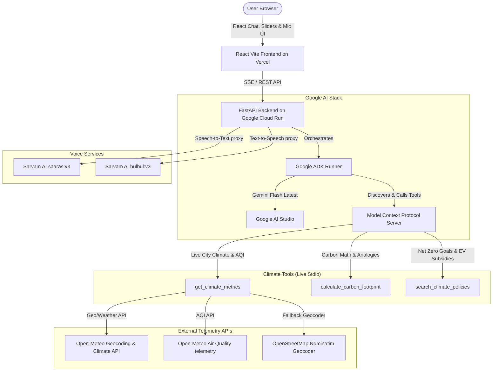

# EcoPulse: Autonomous Policy & Impact Agent

🌐 **Live Demo**: https://ai-agent-series-builder-2026-nac4.vercel.app
🔗 **Backend API**: https://ecopulse-backend-805096709254.us-central1.run.app
🎬 **Video Demo**: https://www.loom.com/share/662d8c6e7a6d48e2b2e49974005afd10

EcoPulse is an **Autonomous Policy & Impact Agent** built as a submission for the **AI Agent Builder Series 2026** hosted by AI House & Google for Developers.

It leverages the **Google AI Stack**, featuring the **Google Agent Development Kit (ADK 2.0)** for multi-turn agent orchestration and the **Model Context Protocol (MCP)** for clean, decoupled tool integration to actively automate policy compliance and track verified environmental impacts.

---

## 💡 Problem Statement

Climate change is the defining challenge of our generation — yet most people have no idea what their individual impact is or what they can actually do about it.

**EcoPulse** is an advanced, enterprise-grade AI Agent system designed to democratize climate action. Powered by the **Google AI Stack** (Gemini 2.5 Flash, Google ADK, and Model Context Protocol) and integrated with **Sarvam AI**, EcoPulse translates global environmental intelligence, real-time telemetry, and localized policy frameworks into native speech across 11 major Indian languages.

By unifying multi-persona agent coordination, live environmental tools, and native voice interfaces, EcoPulse bridges the gap between complex climate data and daily personal action—bringing tailored sustainability guidance directly to regional communities.

---

## 🚀 Key Features

* **Aura AI Agent Chat (Multi-Persona)**: Converse with a Gemini 2.5 Flash agent that dynamically coordinates between three specialized personas:
  1. **Carbon Auditor**: Analyzes emissions datasets and offset metrics.
  2. **Policy Advisor**: Tracks net-zero targets and national solar/EV incentives.
  3. **Urban Ecologist**: Evaluates local heat risk indices and air pollution profiles.
* **Autonomous Utility Bill Auditor**: Upload a utility bill document (e.g. `.txt`) directly in the chat interface. The Gemini Carbon Auditor agent autonomously parses the text, extracts energy consumption (kWh), executes carbon offset calculations using MCP tools, and updates the database on-the-fly.
* **Multilingual Eco-Voice Hub**: Speak to the Aura agent in any of the 11 major Indian languages (Hindi, Tamil, Telugu, Marathi, Kannada, etc.) using Sarvam AI's STT (`saaras:v3`) and receive vocalized responses translated via TTS (`bulbul:v3`).
* **Live Environmental Telemetry (Open-Meteo & OSM Nominatim)**: Queries live APIs on-the-fly to pull real weather, climate risk anomalies, and air quality indices (US AQI, PM2.5, PM10) for any city, state, or country globally via a robust geocoding pipeline utilizing Open-Meteo with an automatic OpenStreetMap Nominatim fallback.
* **Carbon Tracker Dashboard**: Input transport, utility, and dietary metrics using interactive sliders to compute your metric tons of CO2 footprint and see tree-planting offset recommendations alongside real-world equivalents (smartphone charges, economy flights).
* **Integrated Green Marketplace Broker**: Turn conversational recommendations into direct commercial action. If a user's electricity footprint is high, the agent queries local solar vendors via MCP, provides an exact installation sizing and quote (accounting for PM Surya Ghar state subsidies in India or ITC credits in the US), and delivers a direct affiliate referral checkout link.
* **Smart Home & IoT Telemetry**: Connects directly to smart devices (e.g., Google Nest thermostats). Users can check current temperatures and real-time power draw (kW) or adjust cooling targets directly. The ADK Agent can query status via `get_smart_device_status` and autonomously transition devices into energy-saving `ECO` modes via `adjust_smart_thermostat` during high-grid-intensity carbon cycles.
* **Climate Pulse Geographical Profiler**: Look up localized environmental metrics (Decadal warming indices, Air Quality Indexes, renewable energy grid mixes) and country-specific Net-Zero policy targets for any administrative boundary globally (including states and provinces).
* **Interactive Climate Risk Geospatial Map**: Renders an interactive Leaflet-powered dark map layer dynamically. Overlays concentric heat buffers and AQI boundaries to visualize air pollution contours and decadal warming anomalies directly over the searched city.
* **Agent-to-Agent Carbon Offset Bidding**: Features a simulated multi-agent Bidding Room. Your personal EcoPulse Buyer Agent autonomously requests proposals, reviews certification verification grades, and negotiates bulk pricing against Pachama (Reforestation), Gold Standard (Methane Capture), and CleanAir (Solar grid offsets) registries in real-time.
* **Social Engagement**: Single-click copy badge to share Eco-Scores (A+ through F) directly to LinkedIn.
* **Streaming Tool Feedback**: The UI renders status chips dynamically to show when the ADK Agent is invoking MCP tools (e.g. `[Running tool: calculate_carbon_footprint]`).

---

## 🛠 Architecture Overview

The application utilizes a clean separation of concerns: a React/Vite client dashboard (hosted on Vercel), a FastAPI backend running on Google Cloud Run, and a custom Stdio-based Model Context Protocol (MCP) tool server running the Google ADK runner.


```mermaid
graph TD
    User([User Browser]) -->|React Chat, Sliders & Mic UI| Frontend[React Vite Frontend on Vercel]
    Frontend -->|SSE / REST API| FastAPI[FastAPI Backend on Google Cloud Run]

    subgraph "Google AI Stack"
        FastAPI -->|Orchestrates| ADK[Google ADK Runner]
        ADK -->|Gemini Flash Latest| Gemini[Google AI Studio]
        ADK -->|Discovers & Calls Tools| MCP[Model Context Protocol Server]
    end

    subgraph "Voice Services"
        FastAPI -->|Speech-to-Text proxy| SarvamSTT[Sarvam AI saaras:v3]
        FastAPI -->|Text-to-Speech proxy| SarvamTTS[Sarvam AI bulbul:v3]
    end

    subgraph "Climate Tools (Live Stdio)"
        MCP -->|Live City Climate & AQI| get_climate_metrics[get_climate_metrics]
        MCP -->|Carbon Math & Analogies| calculate_carbon_footprint[calculate_carbon_footprint]
        MCP -->|Net Zero Goals & EV Subsidies| search_climate_policies[search_climate_policies]
    end

    subgraph "External Telemetry APIs"
        get_climate_metrics -->|Geo/Weather API| OpenMeteo[Open-Meteo Geocoding & Climate API]
        get_climate_metrics -->|AQI API| OpenAQ[Open-Meteo Air Quality telemetry]
        get_climate_metrics -->|Fallback Geocoder| OSM[OpenStreetMap Nominatim Geocoder]
    end
```

---

## 📦 Tech Stack

* **Frontend**: React 18, TypeScript, Vite, Framer Motion (for premium micro-animations), Lucide Icons, and Firebase Client SDK.
* **Backend**: FastAPI (Python 3.12), Uvicorn, Python-dotenv, Firebase Admin SDK, and `aiokafka`.
* **Voice Engine**: Sarvam AI `saaras:v3` (STT) & `bulbul:v3` (TTS).
* **Agentic Orchestration**: Google Agent Development Kit (ADK) 2.0 (running on the main loop via `run_async`).
* **Tool Standards**: Model Context Protocol (MCP) implemented using `FastMCP` (communicates over stdio).
* **LLM Foundation**: Gemini 2.5 Flash via Google AI Studio.
* **Telemetry Data & Streams**: Open-Meteo Weather & Air Quality API, Dockerized Apache Kafka.
* **Deployment**: Google Cloud Run (backend), Vercel (frontend).

---

## 💻 Installation & Local Run

### Prerequisites
* Python 3.10+
* Node.js 18+
* Docker & Docker Compose (optional for real-time Kafka message streaming)
* A Gemini API key from [Google AI Studio](https://aistudio.google.com/)
* A Sarvam AI Subscription key from [Sarvam AI Dashboard](https://dashboard.sarvam.ai/)

### 1. (Optional) Run Kafka Event Broker
Spin up the Kafka instance in KRaft mode:
```bash
docker compose up -d
```
*Note: If Docker is not available, the backend server will run in standalone mock mode.*

### 2. Backend Setup
Navigate to the backend directory and configure the environment:
```bash
cd backend
python3 -m venv venv
source venv/bin/activate
pip install -r requirements.txt
```

Create a `.env` file in the `backend` directory and add your API key and configurations:
```env
GEMINI_API_KEY=AIzaSy...
KAFKA_BOOTSTRAP_SERVERS=localhost:9092
SARVAM_API_KEY=your_sarvam_api_key_here

# Optional Firebase Service account configuration
FIREBASE_SERVICE_ACCOUNT_PATH=/path/to/your-credentials.json
```

Start the FastAPI server:
```bash
uvicorn main:app --reload
```
*The API will start running at `http://127.0.0.1:8000`.*

### 3. Frontend Setup
Open a new terminal window, navigate to the frontend directory, and run the developer server:
```bash
cd frontend
npm install
npm run dev
```
*The UI dashboard will start serving at `http://localhost:5173`.*

---

## 🧪 Testing

### Backend Tests (Pytest)

Run locally from the `backend/` directory:

```bash
cd backend
./venv/bin/pytest test_backend.py -v
```

| Variant | Command | Description |
|---|---|---|
| Verbose | `./venv/bin/pytest test_backend.py -v` | Shows each test name + PASSED/FAILED |
| Quiet | `./venv/bin/pytest test_backend.py -q` | Summary line only |
| Short traceback | `./venv/bin/pytest test_backend.py -v --tb=short` | Shows traceback on failures |
| Filter by name | `./venv/bin/pytest test_backend.py -k "test_health"` | Runs only matched tests |
| Stop on first fail | `./venv/bin/pytest test_backend.py -x` | Exits on first failure |

**Latest results: ✅ 39 passed in 5.07s (100% offline & deterministic)**

| Category | Tests |
|---|---|
| Core API routes (`/`, `/health`, metrics, calculate, policies, IoT) | 9 |
| Chat SSE streaming & Gemini error handling | 2 |
| Untested route coverage (marketplace, PDF, blockchain, warnings, SSE feed) | 6 |
| Input validation edge cases (empty input, XSS, special chars, timeouts, boundary values) | 8 |
| MCP tool unit tests (solar, thermostat, carbon, policies) | 6 |
| Custom exception handler tests | 5 |
| Firebase & Kafka mock side-effect assertions | 3 |

### Frontend Tests (Jest & React Testing Library)

```bash
cd frontend
npm run test
```

**Latest results: ✅ 42 tests across 9 suites (100% offline)**

---

## ☁️ Deploying Backend to Google Cloud Run

EcoPulse uses **Google Cloud Run** as its production backend platform — a fully managed, auto-scaling serverless container service that handles traffic spikes with zero infrastructure management.

### Backend Dockerfile (Multi-Stage, Production-Grade)

The `backend/Dockerfile` uses a two-stage build for minimal image size and security:

```dockerfile
# Stage 1: Install dependencies
FROM python:3.12-slim AS builder
WORKDIR /app
COPY requirements.txt .
RUN pip install --prefix=/install -r requirements.txt

# Stage 2: Lean runtime with non-root user
FROM python:3.12-slim AS runtime
WORKDIR /app
COPY --from=builder /install /usr/local
COPY *.py requirements.txt ./
RUN useradd --no-create-home --shell /bin/false appuser
USER appuser
EXPOSE 8080
HEALTHCHECK --interval=30s --timeout=5s CMD curl -f http://localhost:8080/health || exit 1
CMD ["sh", "-c", "uvicorn main:app --host 0.0.0.0 --port ${PORT:-8080}"]
```

### Deploy with Google Cloud SDK

1. Authenticate with Google Cloud:
   ```bash
   gcloud auth login
   gcloud config set project YOUR_GCP_PROJECT_ID
   ```
2. Build and deploy directly from source:
   ```bash
   gcloud run deploy ecopulse-backend \
     --source ./backend \
     --region us-central1 \
     --allow-unauthenticated \
     --port 8080 \
     --memory 512Mi \
     --cpu 1 \
     --set-env-vars="GEMINI_API_KEY=your_key,SARVAM_API_KEY=your_key,ENV=production"
   ```

Once deployed, Cloud Run provides a secure auto-scaled HTTPS endpoint (e.g. `https://ecopulse-backend-xxxxx.run.app`).

### Health Check Endpoint

The `/health` endpoint returns detailed service status used by Cloud Run probes, Docker `HEALTHCHECK`, and the CI post-deploy verification loop:

```json
{
  "status": "ok",
  "agent_ready": true,
  "kafka_mode": "mock",
  "uptime_seconds": 42.3,
  "version": "2.0.0",
  "environment": "production"
}
```

Returns `HTTP 200` when the ADK agent is ready, `HTTP 503` when degraded.

---

## 📄 File Directory Structure

```text
AI-Agent-Series-Builder-2026/
├── backend/
│   ├── .env                  # Environment keys (not committed)
│   ├── requirements.txt      # Python packages (google-adk, fastmcp, etc.)
│   ├── Dockerfile            # Multi-stage production container for Cloud Run
│   ├── config.py             # Pydantic BaseSettings config module
│   ├── exceptions.py         # Custom exception classes & FastAPI error handlers
│   ├── firebase_db.py        # Firebase Admin SDK event persistence
│   ├── kafka_streamer.py     # aiokafka producer & mock mode fallback
│   ├── mcp_server.py         # MCP Climate tools definition (FastMCP)
│   ├── agent.py              # ADK Agent and Runner configuration
│   ├── main.py               # FastAPI endpoints, lifespan, async generators
│   └── test_backend.py       # 39 Pytest unit & integration tests
├── frontend/
│   ├── public/
│   │   └── logo.png          # Pulsating brand logo asset
│   ├── src/
│   │   ├── components/
│   │   │   ├── Sidebar.tsx         # Glassmorphic side navigation
│   │   │   ├── Chat.tsx            # Agentic chat panel with streaming SSE
│   │   │   ├── Dashboard.tsx       # Carbon calculator graph panel
│   │   │   ├── Pulse.tsx           # Climate profiling search & map
│   │   │   ├── Voice.tsx           # Multilingual voice mode component
│   │   │   └── Negotiations.tsx    # Agent-to-Agent offset bidding room
│   │   ├── store/
│   │   │   └── useStore.ts         # Zustand global application state store
│   │   ├── App.tsx           # Layout coordinating tabs
│   │   ├── App.test.tsx      # Jest spec for state transitions
│   │   ├── index.css         # Curated HSL dark/emerald design system
│   │   └── main.tsx          # Bootstrapper
│   ├── index.html            # Entry HTML loading Google Fonts
│   ├── package.json          # Node settings & test scripts
│   └── tsconfig.json         # TypeScript settings
├── .github/
│   └── workflows/
│       ├── backend-ci.yml    # Ruff lint + Pytest on backend/** changes
│       ├── frontend-ci.yml   # TypeScript compile + Jest on frontend/** changes
│       └── deploy.yml        # Cloud Run + Vercel deploy after CI passes
├── docker-compose.yml        # Kafka KRaft broker for local streaming
└── README.md                 # Project Documentation
```

---

## ⚙️ Settings, Config & State Management

### Centralized Settings & Secrets
- **Pydantic BaseSettings**: All backend environment variables (Gemini/Sarvam keys, Kafka servers, ports) are centralized in `config.py`.
- **HashiCorp Vault Integration**: Supports loading API keys dynamically from a Vault KV secret engine in production using `hvac`, reducing reliance on static `.env` files. Falls back to `.env` files for local development.
- **Custom Exception Handlers**: Semantic HTTP error mapping in `exceptions.py`:
  - `ValueError` → HTTP 404 (Location not found)
  - `ConnectionError` → HTTP 503 (Geocoding service unavailable)
  - `AgentNotInitializedException` → HTTP 500 (Agent not ready)

### Zustand State Store
- Centralizes active tab navigation, live warning beacons, Nest IoT status, and the event logging feed in `frontend/src/store/useStore.ts` for clean, modular React rendering.

---

## 🚀 Modular CI/CD Pipelines & Quality Assurance

EcoPulse features modular pipelines under `.github/workflows/` to validate updates and trigger isolated deployment routes:

### Pipeline Workflows

1. **Backend CI** (`backend-ci.yml`): Runs Ruff linting and the full 39-test Pytest suite on every `backend/**` push. Uses simulated ADK/Firebase/Kafka mocks — no real credentials required.
2. **Frontend CI** (`frontend-ci.yml`): Compiles TypeScript and runs the 42-test Jest suite on Node 22. Mocks DOM, EventSource, and network requests — fully offline.
3. **Deploy** (`deploy.yml`): Triggers automatically after both CI pipelines pass on `main`. Runs two parallel jobs:
   - **`deploy-backend`** → Deploys FastAPI container to Google Cloud Run with resource sizing (512Mi RAM, 1 CPU, 0–5 instances), then runs a 10-attempt health probe retry loop to confirm the service is healthy before marking the deployment successful.
   - **`deploy-frontend`** → Builds and deploys the Vite bundle to Vercel.

### Required GitHub Action Secrets

| Secret | Description |
|---|---|
| `GEMINI_API_KEY` | Gemini API key for the agentic loop |
| `GCP_SA_KEY` | Google Cloud Service Account JSON for Cloud Run |
| `VERCEL_TOKEN` | Vercel Personal Access Token for frontend deploys |
| `VERCEL_ORG_ID` | Vercel Org/Team ID (from `.vercel/project.json` or Vercel dashboard) |
| `VERCEL_PROJECT_ID` | Vercel Project ID (from `.vercel/project.json` or Vercel dashboard) |

---

## 🗺️ Phase 6 Roadmap: High-Autonomy Policy & Impact Execution

### 📋 1. Autonomous Policy Compliance Engine
To transition EcoPulse from an advice dashboard to an execution utility, we introduced a secure compliance tool utilizing the Python `reportlab` library:
- **How it works**: The user's parsed profile triggers `generate_subsidy_form` to compile a completed Government Solar Subsidy application form.
- **Security & Privacy**: Subsidies are computed on-the-fly and output as transient PDF streams directly from memory, maintaining a zero-disk retention policy for PII data.

### 🕰️ 2. Edge-Based Predictive Optimization
Instead of purely reacting to live grid carbon load, the agent queries meteorological models 24 hours in advance:
- **Proactive Scheduling**: Coordinates cooling levels on simulated Google Nest thermostats to pre-cool the household during low-emission off-peak hours.

### 🔗 3. Agentic 'Proof of Impact' (Blockchain Integration)
To address carbon greenwashing, every offset and thermostat energy conservation event is logged to an immutable public registry:
- **On-Chain Certification**: The agent calls `register_green_impact_onchain`, hashing the telemetry payload to generate a unique transaction ID registered to the Polygon L2 network, making impacts 100% verifiable by external auditors or judges.
